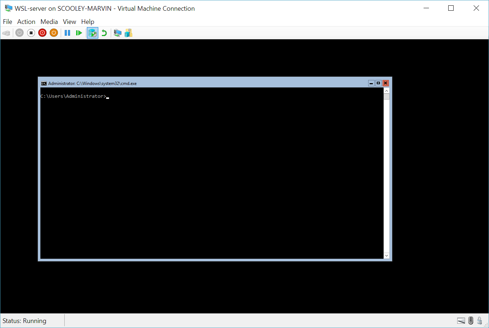
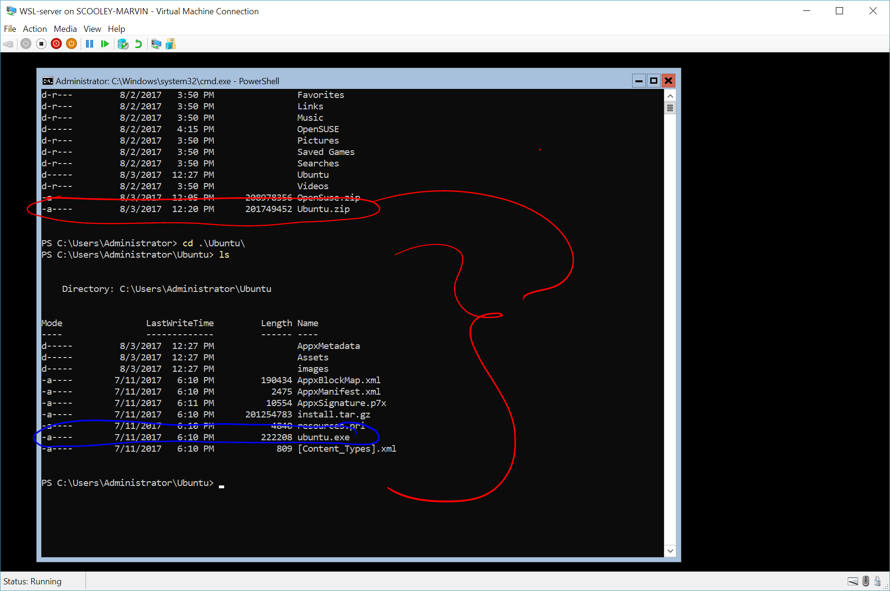
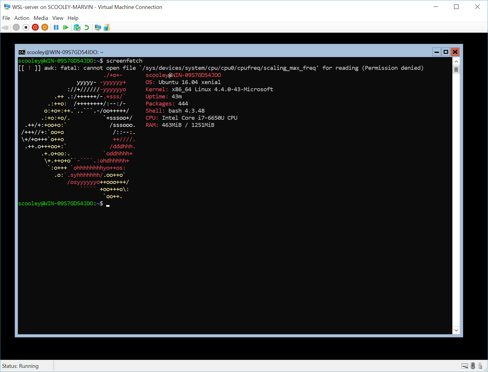

# Windows Server Installation Guide

At //Build2017, Microsoft announced that Windows Subsystem for Linux will be [available on Windows Server](https://blogs.technet.microsoft.com/hybridcloud/2017/05/10/windows-server-for-developers-news-from-microsoft-build-2017/).  These instructions help you become a Windows Insider, download Windows Server, and get Linux running on the Windows Subsystem for Linux.

## Prerequisites

Windows Server (build 16215+).  Right now, that means a Windows Insider's build.

Already have Windows Server preview?  [Skip ahead](install-on-server.md#enable-the-windows-subsystem-for-linux).

### Join Windows Insiders and Download Windows Server

1. Join a Windows Insiders program:
    * [Windows Insiders](https://insider.windows.com)
    * [Windows Insiders for Business](https://insider.windows.com/ForBusiness)

2. Download [Windows Server - Insider Preview](https://www.microsoft.com/en-us/software-download/windowsinsiderpreviewserver).  
Make sure you're logged in, images are only available to Windows Insiders.

### Set up Windows Server

Now that you have a Windows Server image (.iso), install Windows Server on a physical computer or a virtual machine.  I'm going to use a virtual machine on Hyper-V.

Here are instructions for [enabling Hyper-V](https://docs.microsoft.com/virtualization/hyper-v-on-windows/quick-start/enable-hyper-v) and [creating a new virtual machine from an .iso](https://docs.microsoft.com/virtualization/hyper-v-on-windows/quick-start/quick-create-virtual-machine).

During installation, Windows Server will ask for a product key.  The following keys are available for unlimited activations of Windows Server (pre-release builds only). These keys may be used throughout the pre-release cycle.  Read more [here](https://blogs.windows.com/windowsexperience/2017/07/13/announcing-windows-server-insider-preview-build-16237).
* Server Datacenter Core: B69WH-PRNHK-BXVK3-P9XF7-XD84W
* Server Standard Core: V6N4W-86M3X-J77X3-JF6XW-D9PRV

When you're done, you should see something like this:  


### Check your build number

To find your Windows Server build number, run the following in PowerShell:  
``` PowerShell
systeminfo | Select-String "^OS Name","^OS Version"
```

You can also confirm that your build has the Windows Subsystem for Linux by running the following in PowerShell:  
``` PowerShell
PowerShell
Get-WindowsOptionalFeature -Online -FeatureName Microsoft-Windows-Subsystem-Linux
```

## Enable the Windows Subsystem for Linux
Enable the "Windows Subsystem for Linux" optional feature and reboot.

1. Open PowerShell as Administrator and run:
    ``` PowerShell
    PowerShell
    Enable-WindowsOptionalFeature -Online -FeatureName Microsoft-Windows-Subsystem-Linux
    ```

2. Restart your computer when prompted.


## Install a Linux distribution

1. Download the appx for your favorite Linux distribution.  
    Here are links directly to the apps available through the store:
    * [Ubuntu](https://aka.ms/wsl-ubuntu-1604)
    * [OpenSUSE](https://aka.ms/wsl-opensuse-42)
    * [SLES](https://aka.ms/wsl-sles-12)

    You can download the distributions to Windows Server with [`Invoke-WebRequest`](https://msdn.microsoft.com/powershell/reference/5.1/microsoft.powershell.utility/invoke-webrequest) cmdlet.  Here's a sample instruction to download OpenSUSE.
    
    ``` PowerShell
    PowerShell
    Invoke-WebRequest -Uri https://aka.ms/wsl-ubuntu-1604 -OutFile ~/Ubuntu.zip -UseBasicParsing
    ```
    
    > **Tip:**  If the download is taking a long time, turn off the progress bar by setting `$ProgressPreference = 'SilentlyContinue'`


3. Unzip the file
    ``` PowerShell
    Expand-Archive ~/Ubuntu.zip ~/Ubuntu
    ```
    
    Make sure your target directory (`~/Ubuntu` in this example) is on your system drive.  Usually this is your C: drive.  
    Example: `C:\Distros\Ubuntu`

    The contents should look like this:
    

5. Run the installer, named `<distro>.exe`  
    For example: `ubuntu.exe`, `fedora.exe`, etc.

    > **Troubleshooting: Installation failed with error 0x8007007e**  
    > This error occurs when your system doesn't support WSL.  Make sure that:
    > * You're running Windows build 16215 or later. [Check your build](install_guide.md#prerequisites).
    > * The Windows Subsystem for Linux optional component is enabled and the computer has restarted.  [Instructions here](install_guide.md#install-the-windows-subsystem-for-linux).

4. Create a UNIX user
    
    The first time you install the Windows Subsystem for Linux, you will be prompted to create a UNIX username and password.  
    
    This UNIX username and password can be different from, and has no relationship to, your Windows username and password. [Learn more about your UNIX account.](https://msdn.microsoft.com/en-us/commandline/wsl/user_support).

5.  Run distro's preferred update/upgrade.

    ``` BASH
    sudo apt-get update
    sudo apt-get upgrade
    ```

You're done!  Go use your new Linux environment!


