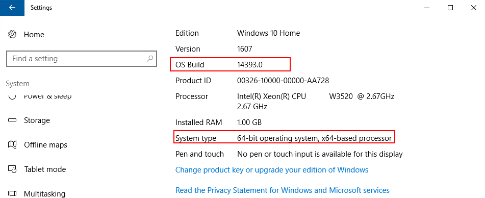

# Windows 10 Installation Guide

## Prerequisites
Your PC must be running a 64-bit version of Windows 10.

This guide is based on the Fall Creator's Update.  For earlier versions of Windows 10, follow [these instructions using lxrun](install_guide.md#For-Anniversary-Update-and-Creators-Update).

> To find your PC's architecture and Windows build number, open  
    **Settings** > **System** > **About**.  
    Look for the **OS Build** and **System Type** fields.
     

## Install the Windows Subsystem for Linux
Enable the "Windows Subsystem for Linux" optional feature and reboot.

1. Open PowerShell as Administrator and run:
    ``` PowerShell
    Enable-WindowsOptionalFeature -Online -FeatureName Microsoft-Windows-Subsystem-Linux
    ```

2. Restart your computer when prompted.

### Install Linux distribution of choice

1. Open the Windows Store and choose your favorite Linux distribution.      
    Here are links directly to the store installers:
    * [Ubuntu](https://www.microsoft.com/store/p/ubuntu/9nblggh4msv6)
    * [OpenSUSE](https://www.microsoft.com/store/apps/9njvjts82tjx)
    * [SLES](https://www.microsoft.com/store/apps/9p32mwbh6cns)

2. Select "Install"  
    

### Create a UNIX user
The first time you install Bash on Windows, you will be prompted to create a UNIX username and password.


  
This UNIX username and password can be different from, and has no relationship to your Windows username and password. [Read more](https://msdn.microsoft.com/en-us/commandline/wsl/user_support).

## For Anniversary Update and Creators Update
1. Turn on Developer Mode
    
    Open Settings -> Update and Security -> For developers
    
    Select the Developer Mode radio button  
	  

2. Enable the Windows Subsystem for Linux feature
    Open a PowerShell prompt as administrator and run:
    ``` PowerShell
    Enable-WindowsOptionalFeature -Online -FeatureName Microsoft-Windows-Subsystem-Linux
    ```
  
    Restart your Computer

4. Accept the License and Expand the Image
    
    Open a command prompt.  Run `bash`  
    
    
    After you have accepted the License, the Ubuntu user-mode image will be downloaded and extracted. A "Bash on Ubuntu on Windows" shortcut will be added to your start menu.

5. Launch Bash
    
    Either run `bash` at a cmd/PowerShell command-prompt, or use the start menu shortcut.

6. Create a UNIX user
    
    The first time you install Bash on Windows, you will be prompted to create a UNIX username and password.  
    
    
    This UNIX username and password can be different from, and has no relationship to, your Windows username and password. [Learn more about your UNIX account.](https://msdn.microsoft.com/en-us/commandline/wsl/user_support).

You're done!

After installation your Linux distribution will be located at: `%localappdata%\lxss\`.

**Avoid creating and/or modifying files in %localappdata%\lxss\ using Windows tools and apps!** If you do, it is likely that your Linux files will be corrupted and data loss may occur. Avoid this issue by using a directory located under /mnt/.  
Read this [blog post](https://blogs.msdn.microsoft.com/commandline/2016/11/17/do-not-change-linux-files-using-windows-apps-and-tools/) for more information.